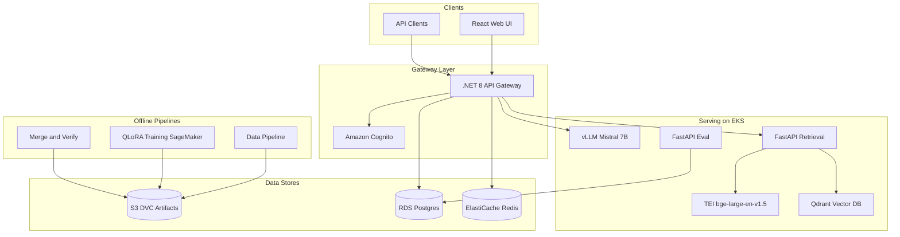

# DomainMind

Production-ready, multi-tenant, HIPAA/SOC 2-aligned domain-specific LLM platform on AWS.

## Architecture



## Quick start (local)

```bash
# Python pipelines
cd pipelines && uv sync && uv run pytest

# Docker Compose (no PHI)
docker compose -f infra/compose/docker-compose.yml up -d

# .NET gateway
cd gateway && dotnet run --project src/DomainMind.Gateway

# React UI
cd apps/web && npm install && npm run dev

# Marketing site
cd marketing-site && npm install && npm run dev
```

## Repository layout

| Path | Purpose |
|------|---------|
| `pipelines/` | Data prep, QLoRA training, merge (Python/uv) |
| `services/` | Retrieval, inference config, eval (FastAPI) |
| `gateway/` | API gateway (.NET 8) |
| `apps/web/` | React + TypeScript product UI |
| `marketing-site/` | Customer-facing marketing website (Vite + React) |
| `infra/aws/` | Terraform (VPC, EKS, SageMaker, RDS, etc.) |
| `infra/k8s/` | Kubernetes manifests + ADOT |
| `shared/openapi/` | Spec-first REST contracts |

## Compliance

- AWS BAA required before PHI processing
- PHI scrubber (Presidio) in data pipeline before chunking
- Customer-managed KMS on S3, RDS, ElastiCache
- See `docs/runbooks/compliance-checklist.md`

## Documentation

- [Wiki (index)](docs/index.md)
- [Architecture](docs/architecture.md)
- [QLoRA Pipeline LLD](docs/DomainMind_QLoRA_Pipeline.md)
- [M0 Day-1 checklist](docs/runbooks/m0-day1-checklist.md)
