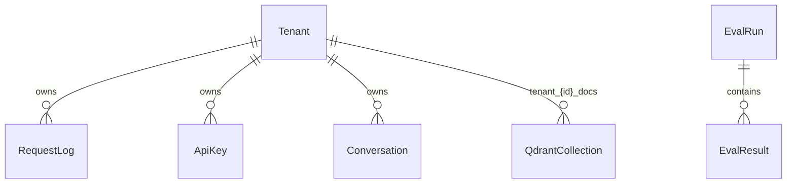

# Data model

Core entities inferred from `gateway/`, `services/`, and pipeline docs. ER diagrams are **not documented**; relationships below are from code.

## Gateway (PostgreSQL / EF Core)

| Entity | Key fields | Purpose |
|--------|------------|---------|
| `RequestLog` | `Id`, `TenantId`, `PromptTokenized`, `ResponseTokenized`, `ModelMode`, `CreatedAt` | Audit / usage logging |
| `ApiKey` | `Id`, `TenantId`, `KeyHash`, `Role`, `IsActive` | Tenant API keys (hash stored) |
| `Conversation` | `Id`, `TenantId`, `Title`, `MessagesJson`, `UpdatedAt` | Chat history blob |

*Source: `gateway/src/DomainMind.Gateway/Data/GatewayDbContext.cs`.*

**Constraints:** `TenantId` required on tenant-scoped rows. Per-tenant PostgreSQL **schema** via `search_path` is described in architecture (M11) — implementation depth **needs confirmation** beyond middleware.

## Eval service (PostgreSQL / SQLAlchemy)

| Entity | Key fields | Purpose |
|--------|------------|---------|
| `EvalResult` | `id`, `run_id`, `model_version`, `system_mode`, `metric_name`, `score`, `judge_model`, `created_at` | Metric rows per eval run |

*Source: `services/eval_service/db.py`.*

## Vector store (Qdrant)

| Concept | Naming | Notes |
|---------|--------|-------|
| Collection per tenant | `tenant_{tenant_id}_docs` | `services/retrieval/qdrant_store.py` |
| Point payload | `chunk_id`, `text`, `source`, `doc_name`, scores | Retrieve API schema |

Default vector size **1024** (inferred from `ensure_collection`).

## Offline / artifacts (S3 + DVC)

Training and merged model artifacts on S3 (DVC). JSONL training records after pipeline stages. Golden set: `evals/golden_set.jsonl` — **must not** appear in train/val splits (`AGENTS.md`).

## Relationships (logical)

`Tenant` is not a DB table; tenant identity comes from JWT / headers (see [security-and-access.md](security-and-access.md)).
